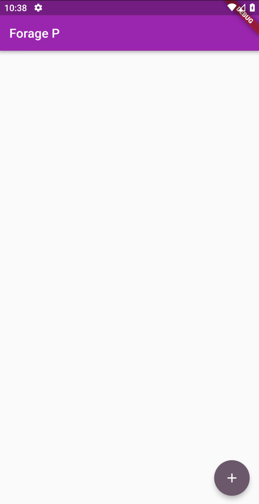
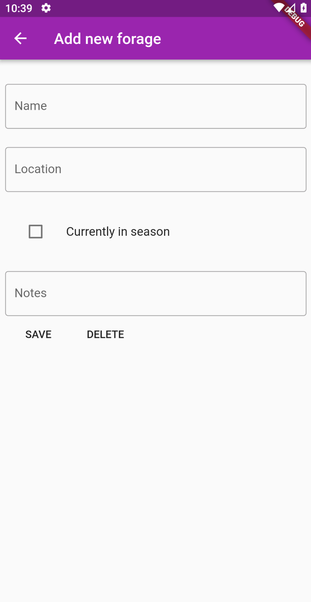

# App - Forage

App para practicar los siguientes temas:
- Provider para manejo de estados
- Creacion de modelos
- Navegacion entre paginas
- Variables privadas
- Getters y Setters
- Alineacion de widgets

## Getting Started

Recuerda que despues de clonar el proyecto, abrir una terminal dentro de la carpeta del proyecto y ejecutar el comando:

```sh
flutter packages get
``` 

## App Screenshot





